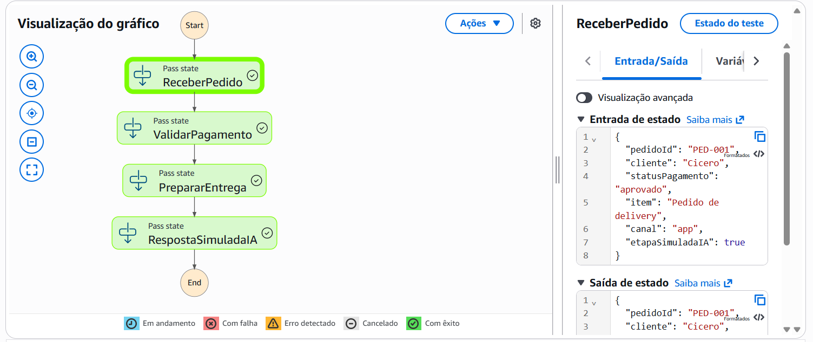
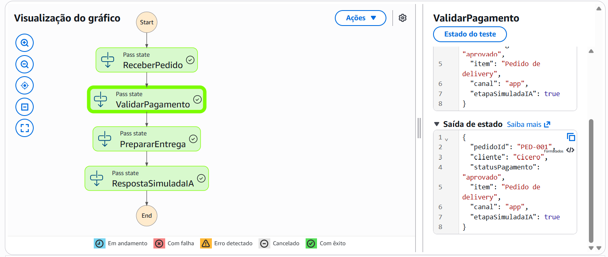
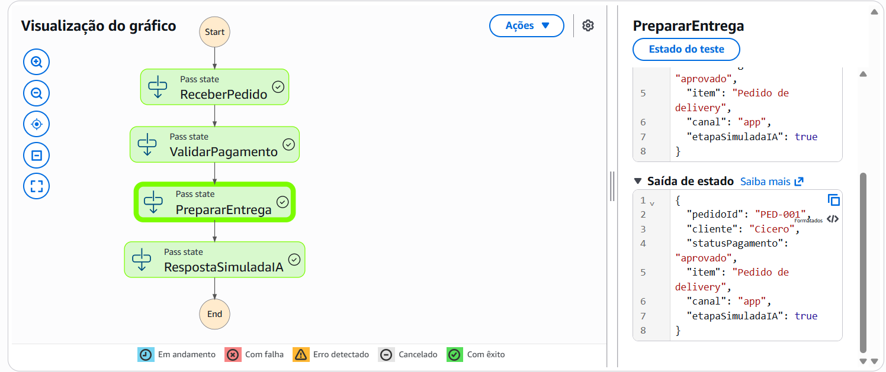
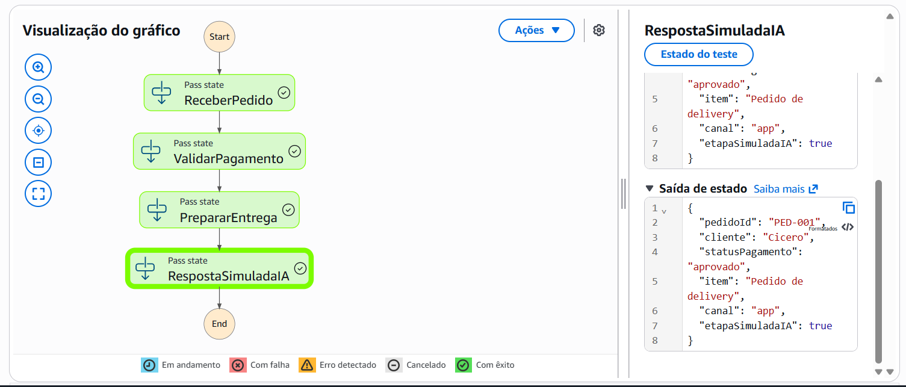
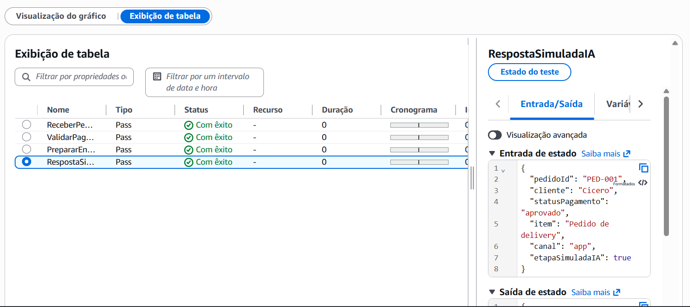

# Bootcamp AWS - Agentes de IA em Campo

Este repositório reúne meus estudos, práticas e projetos desenvolvidos durante o Bootcamp AWS - Agentes de IA em Campo.

O objetivo é documentar minha evolução no uso de serviços da AWS relacionados a automação, fluxos de trabalho e inteligência artificial, incluindo AWS Step Functions, Amazon Bedrock e outros recursos abordados no programa.

## Projetos documentados

### 01 - Assistente de Delivery com AWS Step Functions

Projeto simulado de um assistente de delivery usando AWS Step Functions.

Como o Amazon Bedrock ainda não está funcionando corretamente na minha conta, a etapa de resposta com IA foi representada de forma simulada dentro do fluxo.

Fluxo criado:

1. ReceberPedido
2. ValidarPagamento
3. PrepararEntrega
4. RespostaSimuladaIA

Status: execução realizada com sucesso no AWS Step Functions.

## Evidências da execução

Fluxo criado no AWS Step Functions:

Execução realizada com sucesso:

Entrada JSON utilizada no teste:

Etapa simulada de resposta com IA:

Tabela com as etapas executadas com sucesso:

## Arquivos do projeto

- `step-functions/assistente-delivery.asl.json`: definição da máquina de estado criada no AWS Step Functions.
- `examples/input-pedido.json`: exemplo de entrada JSON usado na execução de teste.
- `images/`: evidências visuais da criação e execução do fluxo.

## Tecnologias e serviços utilizados

- AWS Step Functions
- Amazon Bedrock
- Amazon Nova
- Conceitos de agentes de IA
- GitHub para documentação de projetos

## Observação sobre o Amazon Bedrock

Durante a realização do projeto, o Amazon Bedrock apresentou o erro:

`ValidationException: Operation not allowed`

O erro ocorreu ao tentar usar modelos Amazon Nova Micro e Amazon Nova Lite na região us-east-1. Por isso, a integração real com o Bedrock será adicionada futuramente, após a normalização do acesso na conta AWS.

## Autor

Cícero Henrique Jr.

Estudante de Gestão da Tecnologia da Informação, em transição para a área de Cloud, DevOps e Inteligência Artificial.
