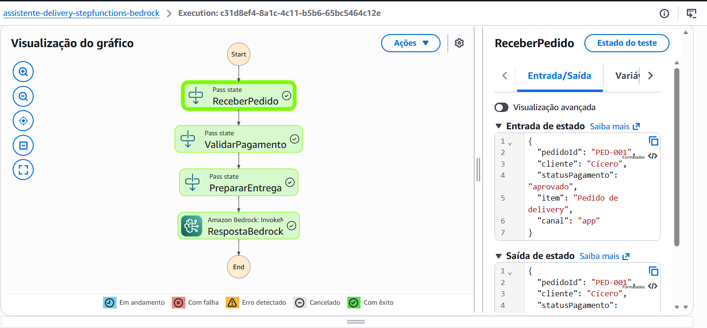
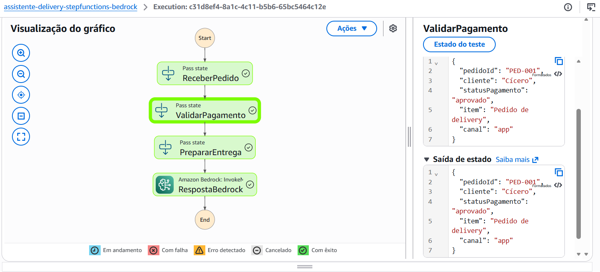
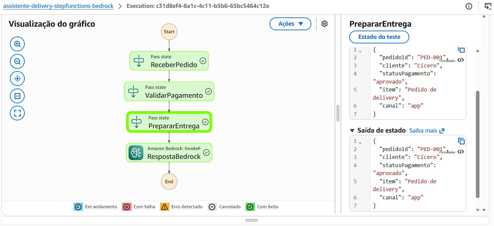
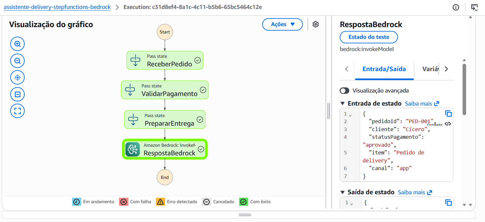
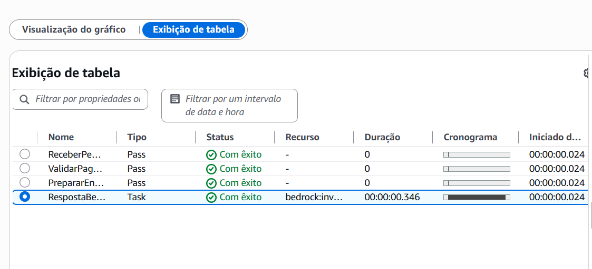

# Bootcamp AWS - Agentes de IA em Campo

Este repositório reúne meus estudos, práticas e projetos desenvolvidos durante o Bootcamp AWS - Agentes de IA em Campo.

O objetivo é documentar minha evolução no uso de serviços da AWS relacionados à automação, fluxos de trabalho e inteligência artificial, incluindo AWS Step Functions, Amazon Bedrock e outros recursos abordados no programa.

## Projetos documentados

### 01 - Assistente de Delivery com AWS Step Functions

Projeto simulado de um assistente de delivery utilizando AWS Step Functions e Amazon Bedrock.

O fluxo foi desenvolvido para representar etapas de processamento de um pedido, desde o recebimento das informações até a geração de uma resposta utilizando inteligência artificial.

### Fluxo criado

1. ReceberPedido
2. ValidarPagamento
3. PrepararEntrega
4. RespostaBedrock

A execução do fluxo foi realizada com sucesso no AWS Step Functions, incluindo a integração com o Amazon Bedrock.

## Evidências da execução

### Fluxo criado no AWS Step Functions

### Execução realizada com sucesso

### Entrada JSON utilizada no teste

### Resposta gerada pelo Amazon Bedrock

### Tabela com as etapas executadas

## Arquivos do projeto

- `step-functions/assistente-delivery.asl.json`: definição da máquina de estado criada no AWS Step Functions.
- `examples/input-pedido.json`: exemplo de entrada JSON utilizado na execução de teste.
 - `images/step-functions/`: evidências visuais da criação e execução do fluxo no AWS Step Functions.
- `images/bedrock/`: evidências visuais da integração e execução com o Amazon Bedrock. 

## Tecnologias e serviços utilizados

- AWS Step Functions
- Amazon Bedrock
- Amazon Nova Micro
- Conceitos de agentes de IA
- JSON
- GitHub para documentação de projetos

## Observação sobre o Amazon Bedrock

Durante o desenvolvimento do projeto, inicialmente houve uma dificuldade de acesso aos modelos Amazon Nova Micro e Amazon Nova Lite na região `us-east-1`, com ocorrência do erro:

`ValidationException: Operation not allowed`

Após os ajustes realizados, foi possível executar uma etapa do AWS Step Functions utilizando o Amazon Bedrock.

A execução apresentou status de sucesso e o modelo Amazon Nova Micro retornou uma resposta relacionada ao pedido de delivery.

## Autor

Cícero Henrique Jr.

Estudante de Gestão da Tecnologia da Informação, em transição para a área de Cloud, DevOps e Inteligência Artificial.
